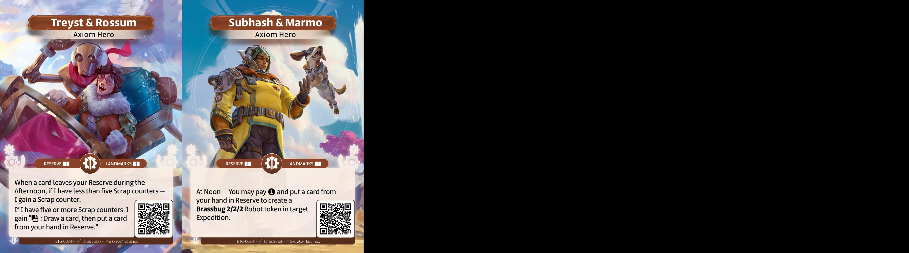
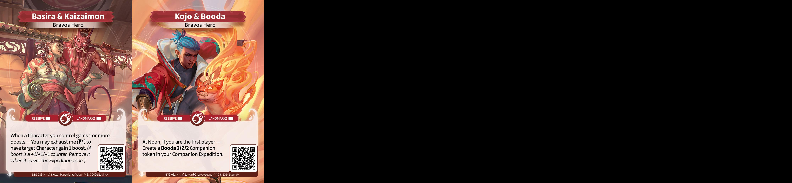
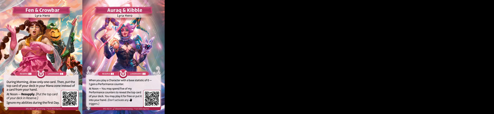
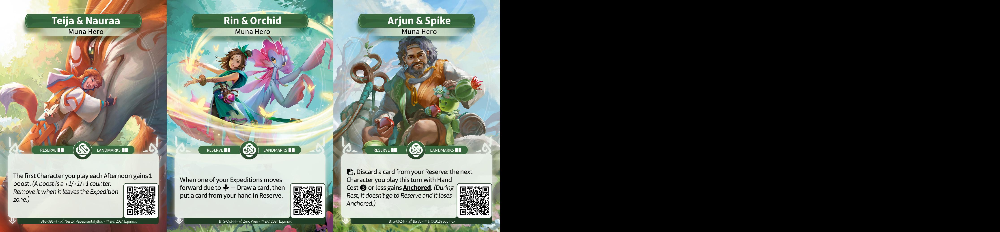
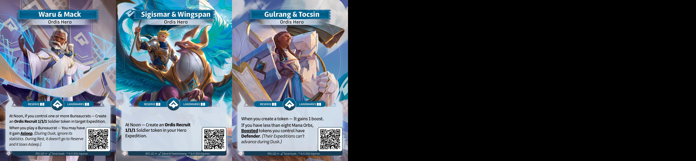
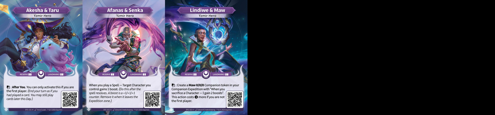

### Altered Cube Core Set

## Introduction

Ce cube a pour vocation d'apporter une expérience plus poussée du draft en Core
Set. Le format de draft étant plus puissant que le construit, ce cube cherche à
équilibrer le format limité en limitant les stratégies oppressantes et en
favorisant certaines synergies.

## The List

## Architecture et Direction du Cube

Ce cube se joue avec 3 boosters. Les deux premiers boosters draftés contiennent
16 cartes dont un héros. Le dernier booster en contient 15, sans héros. Le cube
est pensé pour être drafté à 8 joueurs. Il contient 360 cartes, 60 par faction
plus 16 cartes de héros. Ces choix permettent d'avoir moins de cartes qu'avec 4
boosters de 12 cartes, donc de laisser plus de choix lors de la construction du
cube (comme pour inciter des paires de factions via les Out Of Faction (OOF), ou
via l'absence de cartes clés dans sa faction d'origine).

Choisir de n'avoir que 16 héros est un choix inélégant mais pratique. Lyra et
Bravos perdent chacun un héros (Atsadi et Nevenka) qui sont difficiles de
supporter dans le cube. Je pense que même avec les 18 héros dans le cube, les
héros n'offrent pas l'égalité des chances pour la jouabilité de chaque faction.
Cependant, comme chaque deck a accès à 3 factions, certaines factions ont plutôt
vocation à supporter une stratégie plutôt qu'à en être le coeur.

Je me questionne encore sur la répartition de chaque carte dans le cube. Je ne
souhaite qu'aucune carte ne soit trop présente dans le cube, donc impossible de
voir 5 fois la même carte. Le maximum est fixé à 4 par la répartition suivante:
2 dans la faction d'origine, 2 en OOF. La majeure partie des cartes est présente
en seulement 2 exemplaires. Plus rarement, certaines cartes sont présentes en 3
exemplaires dans leur faction d'origine, afin de donner une direction. Les cas
de cartes en un seul exemplaire sont extrêmement rares, là uniquement pour
réguler un aspect précis du cube (ici Lyra Festival).

## Ownership of /images content

I do not own any of the arts in the images directory, they belong to Equinox
Studio, owner of Altered TCG.
