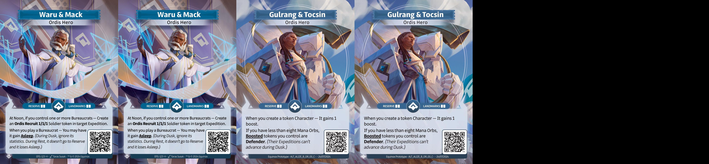

### Altered Cube Core Set

## Introduction

This cube aims to bring a more advanced experience to the Core Set draft. Due to
an unbalanced draft format, equilibrium is brought through absence of certain
hero and enhanced archetypes.

## The List

## Architecture and Direction

### How to cube ?

This cube is played with 3 fifteen card boosters and 24 hero pool. First, 3
different faction hero are dealt to each players, then the draft phase begins
normally. Deck building rules are the same as a classic Altered draft.

### Cube's repartition

Each faction contains 60 cards with no regards on OOF (out of faction) or on
rarity. Cards are present alone (1 per faction), as a pair (25 per faction) or
as a trio (3 per faction). As a all, cards can be present at most 4 times (two
pairs in two different factions). Trios aims to give a direction and faction
identity.

Having less cards to draft with 3 fifteen cards boosters (than 4 twelve ones)
and cutting hero help make disappear oppressive archetypes (by absence of key
cards). In addition to that, OOF's over-presence (compared to a classic draft)
create new powered archetype. Each hero is playable, even if some faction tends
more to support others that assume a primary role.

## Ownership of /images content

I do not own any of the arts in the images directory, they belong to Equinox
Studio, owner of Altered TCG.
