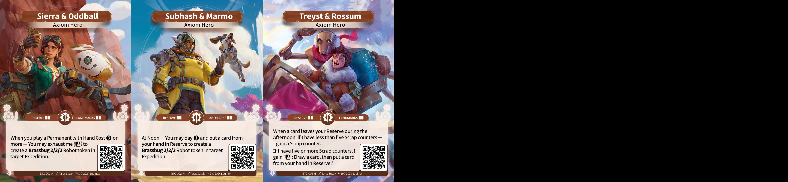

### Altered Cube Core Set

## Introduction

Ce cube a pour vocation d'apporter une expérience plus poussé du draft en Core
Set. Des questions restent en suspens comme les restrictions autour des Héros,
si il faut en lister 12 ou 18 et la présence d'unique. Le but sous jacent est
de mettre en lumière des interactions rares.

## The List

## Ownership of /images content

I do not own any of the arts in the images directory, they belong to Equinox
Studio, owner of Altered TCG.
