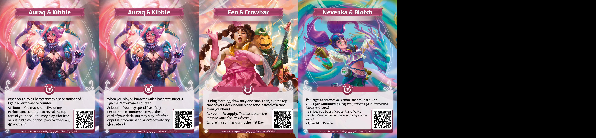
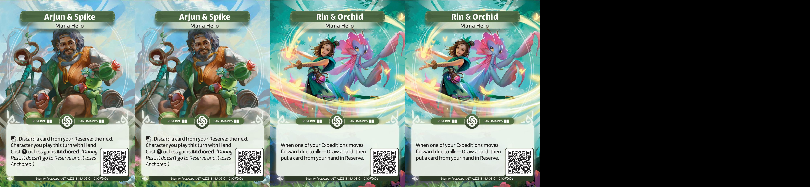

### Altered Cube Core Set

## Introduction

Ce cube a pour vocation d'apporter une expérience plus poussée du draft en Core
Set. Le format de draft étant plus puissant que le construit, ce cube cherche à
équilibrer le format limité en limitant les stratégies oppressantes et en
favorisant certaines synergies.

## The List

## Architecture et Direction du Cube

Ce cube se joue avec 3 boosters. Les deux premiers boosters draftés contiennent
16 cartes dont un héros. Le dernier booster en contient 15, sans héros. Le cube
est pensé pour être drafté à 6 joueurs. Il contient 270 cartes, 45 par faction
plus 12 cartes de héros. Ces choix permettent d'avoir moins de cartes qu'avec 4
boosters de 12 cartes, donc de laisser plus de choix lors de la construction du
cube (comme pour inciter des paires de factions via les Out Of Faction (OOF), ou
via l'absence de cartes clés dans sa faction d'origine).

Le choix de n'avoir que 12 héros plutôt que 18 permet de couper les héros
oppressants ou trop faible (difficile à supporter). Ainsi, Sierra, Atsadi,
Nevenka, Rin, Sigismar et Lindiwe sont absent de ce cube.

## Ownership of /images content

I do not own any of the arts in the images directory, they belong to Equinox
Studio, owner of Altered TCG.
